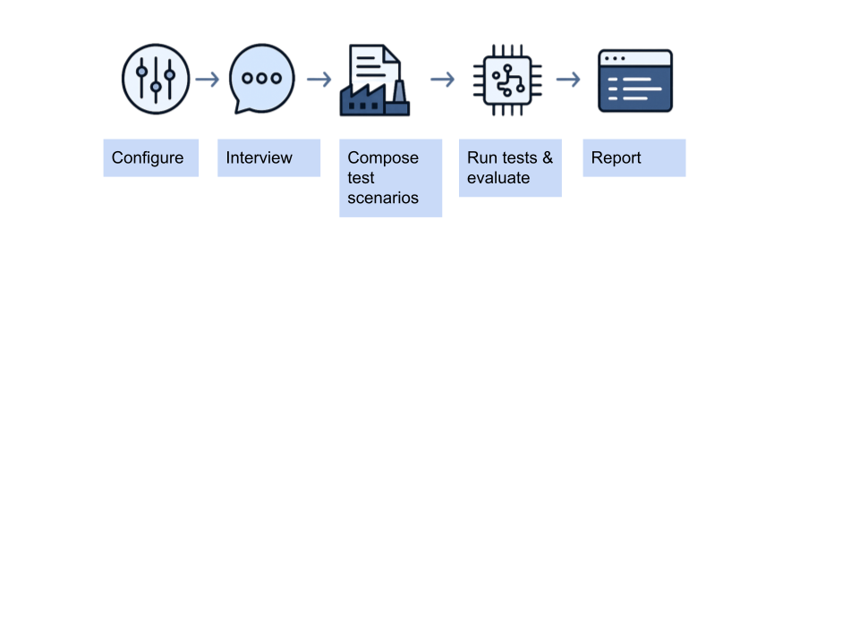

# Rogue - The AI Agent Evaluator

<div align="center">

[](https://www.elastic.co/licensing/elastic-license)


</div>

Rogue is a powerful, tool designed to evaluate the performance, compliance, and reliability of AI agents. It pits a dynamic `EvaluatorAgent` against your agent using Google's A2A protocol, testing it with a range of scenarios to ensure it behaves exactly as intended.



## Key Features

- **🔄 Dynamic Scenario Generation**: Automatically creates a comprehensive test suite from your high-level business context.
- **👀 Live Evaluation Monitoring**: Watch the interaction between the Evaluator and your agent in a real-time chat interface.
- **📊 Comprehensive Reporting**: Generates a detailed summary of the evaluation, including pass/fail rates, key findings, and recommendations.
- **🔍 Multi-Faceted Testing**: Natively supports testing for policy compliance, with a flexible framework to expand to other areas like prompt injection or safety.
- **🤖 Broad Model Support**: Compatible with a wide range of models from providers like OpenAI, Google (Gemini), and Anthropic.
- **🎯 User-Friendly Interface**: A simple, step-by-step Gradio UI guides you through configuration, execution, and reporting.

---

## How It Works

Rogue's workflow is designed to be simple and intuitive, managed entirely through its web interface.

1.  **Configure**: You provide the endpoint and authentication details for the agent you want to test, and select the LLMs you want Rogue to use for its services (scenario generation, judging).
2.  **Generate Scenarios**: You input the "business context" or a high-level description of what your agent is supposed to do. Rogue's `LLM Service` uses this context to generate a list of relevant test scenarios. You can review and edit these scenarios.
3.  **Run & Evaluate**: You start the evaluation. The `Scenario Evaluation Service` spins up the `EvaluatorAgent`, which begins a conversation with your agent for each scenario. You can watch this conversation happen live.
4.  **View Report**: Once all scenarios are complete, the `LLM Service` analyzes the results and generates a Markdown-formatted report, giving you a clear summary of your agent's performance.

---

## 🔥 Quick Start

### Prerequisites

- Python 3.10+
- An API key for an LLM provider (e.g., OpenAI, Google, Anthropic).

### Installation

1.  **Clone the repository:**

    ```bash
    git clone https://github.com/qualifire-dev/rogue.git
    cd rogue
    ```

2.  **Install dependencies:**

    If you are using uv:

    ```bash
    uv sync
    ```

    Or, if you are using pip:

    ```bash
    pip install -e .
    ```

3.  **OPTIONALLY: Set up your environment variables:**
    Create a `.env` file in the root directory and add your API keys. Rogue uses `LiteLLM`, so you can set keys for various providers.
    ```env
    OPENAI_API_KEY="sk-..."
    ANTHROPIC_API_KEY="sk-..."
    GOOGLE_API_KEY="..."
    ```

### Running Rogue

Launch the Gradio web UI with the following command:

If you are using uv:

```bash
uv run -m rogue
```

If not:

```bash
python -m rogue
```

Navigate to the URL displayed in your terminal (usually `http://127.0.0.1:7860`) to begin.

---

## Example: Testing the T-Shirt Store Agent

This repository includes a simple example agent that sells T-shirts. You can use it to see Rogue in action.

1. **Install exmaple dependencies:**
    
    If you are using uv:
    ```bash
     uv sync --group examples
    ```
   
    or, if you are using pip:
    ```bash
    pip install -e .[examples]
    ```

2. **Start the example agent server** in a separate terminal:

    If you are using uv:

    ```bash
    uv run examples/tshirt_store_agent
    ```

    If not:

    ```bash
    python examples/tshirt_store_agent
    ```

    This will start the agent on `http://localhost:10001`.

3.  **Configure Rogue** in the UI to point to the example agent:

    - **Agent URL**: `http://localhost:10001`
    - **Authentication**: `no-auth`

4.  **Run the evaluation** and watch Rogue test the T-Shirt agent's policies!

---

## Supported Models

_The following tables show the models we have tested with Rogue._

### We have successfully run our agent with the following models:

#### OpenAI:

- openai/gpt-4.1
- openai/gpt-4.1-mini
- openai/gpt-4.5-preview
- openai/gpt-4o
- openai/gpt-4o-mini
- openai/o4-mini

#### Gemini (vertex or google-ai):

- gemini-2.5-flash
- gemini-2.5-pro

#### Anthropic:

- anthropic/claude-3-5-sonnet-latest
- anthropic/claude-3-7-sonnet-latest
- anthropic/claude-4-sonnet-latest

### The following models are not supported:

#### OpenAI:

- openai/o1 (including mini)
- openai/o4 (including mini)

#### Gemini (vertex or google-ai):

- gemini-2.5-flash (partial support)

---

## Contributing

Contributions are welcome! If you'd like to contribute, please follow these steps:

1.  Fork the repository.
2.  Create a new branch (`git checkout -b feature/your-feature-name`).
3.  Make your changes and commit them (`git commit -m 'Add some feature'`).
4.  Push to the branch (`git push origin feature/your-feature-name`).
5.  Open a pull request.

Please make sure to update tests as appropriate.

## License

This project is licensed under the MIT License - see the [LICENSE](LICENSE) file for details.
